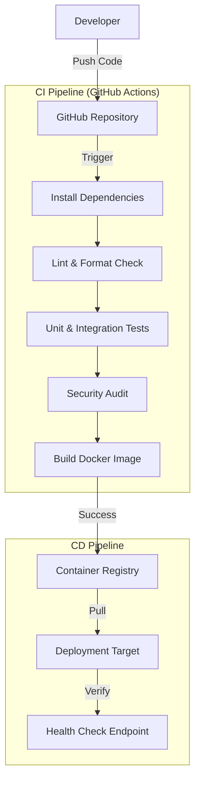
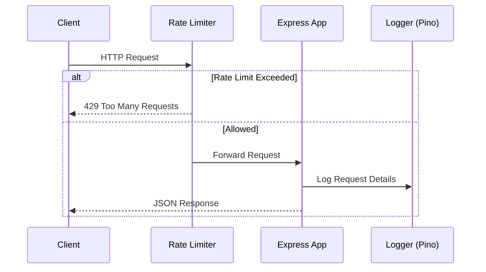

# CI/CD Node.js Application

[](https://github.com/ThebeLedwaba/ci-cd-node-app/actions)
[](LICENSE)
[](https://hub.docker.com/)

A production-grade Node.js application demonstrating enterprise DevOps practices, including a fully automated CI/CD pipeline, comprehensive testing, security hardening, and multi-cloud deployment strategies.

## Architecture

The following diagram illustrates the continuous integration and deployment pipeline implemented in this project:



### Request Flow

The following sequence diagram demonstrates how a client request is processed:



## Features

- **Automated CI/CD**: GitHub Actions pipeline for linting, testing, building, and deploying.
- **Modern Stack**: Node.js 20+, Express 5, ES Modules.
- **API Documentation**: Interactive OpenAPI 3.0 documentation via Swagger UI.
- **Structured Logging**: JSON-formatted logging with Pino for better observability.
- **Containerization**: Multi-stage Docker builds for optimized, secure production images.
- **Code Quality**: Enforced via ESLint, Prettier, and Husky pre-commit hooks.
- **Security**: Implements Helmet, Rate Limiting, and CORS.

## Prerequisites

Ensure the following tools are installed on your system:

- **Node.js**: v20.0.0 or higher
- **npm**: v10.0.0 or higher
- **Docker**: (Optional) for containerized execution

## Installation

1.  **Clone the repository**:
    ```bash
    git clone https://github.com/ThebeLedwaba/ci-cd-node-app.git
    cd ci-cd-node-app
    ```

2.  **Install dependencies**:
    ```bash
    npm install
    ```

3.  **Configure Environment**:
    Copy the example environment file and update as needed.
    ```bash
    cp .env.example .env
    ```

## Configuration

The application is configured via environment variables.

| Variable | Description | Default |
| :--- | :--- | :--- |
| `PORT` | Server listening port | `3000` |
| `NODE_ENV` | Application environment (`development`, `production`, `test`) | `development` |
| `LOG_LEVEL` | Logging verbosity | `info` |

## Usage

### Development

Start the application in development mode with hot-reloading:

```bash
npm run dev
```

The server will start at `http://localhost:3000`.
API Documentation is available at `http://localhost:3000/api/docs`.

### Production

Start the application in production mode:

```bash
npm start
```

### Docker

Build and run the application using Docker:

```bash
# Build the image
docker build -t ci-cd-node-app .

# Run the container
docker run -p 3000:3000 --env-file .env ci-cd-node-app
```

## Testing & Quality

To ensure code quality and correctness, run the following commands:

-   **Run Unit & Integration Tests**:
    ```bash
    npm test
    ```

-   **Run Linter**:
    ```bash
    npm run lint
    ```

-   **Fix Linting Issues**:
    ```bash
    npm run lint:fix
    ```

## Project Structure

```text
ci-cd-node-app/
├── src/
│   ├── config/          # Configuration files (Swagger, etc.)
│   ├── utils/           # Utility functions (Healthcheck, etc.)
│   └── app.js           # Application entry point
├── test/                # Unit and Integration tests
├── .github/workflows/   # CI/CD pipeline definitions
├── Dockerfile           # Multi-stage Docker build instruction
├── eslint.config.js     # ESLint configuration
└── package.json         # Project dependencies and scripts
```

## License

This project is licensed under the MIT License. See the `LICENSE` file for details.
